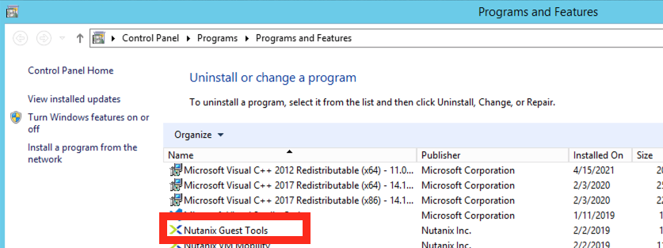
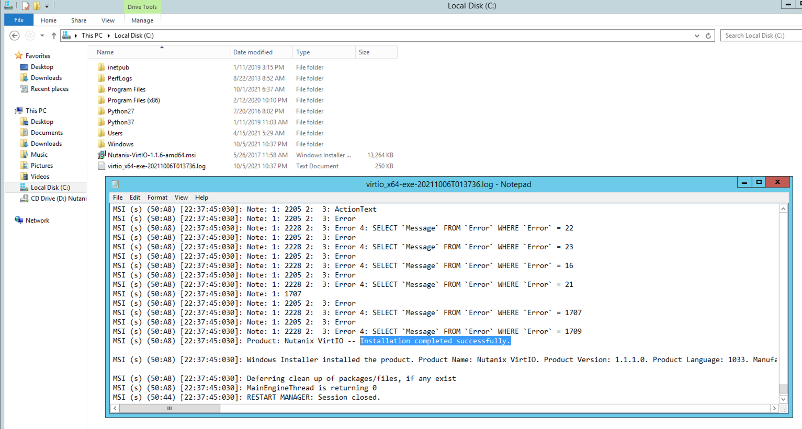

# Ansible Automation for Installing Nutanix Tools

This is a sample repo to get started with Ansible integration with Windows. Although this is not a new concept.

This is a repo to just share the folder structure to instlal Nutanix VirtIO with interested parties. 

There is a plan to increase the contents of this repo to include more Nutanix based use cases which can be achieved with Ansible.

Ansible uses a server and a client-less connection mechanism.

## Table of Contents

We will do the following to setup Ansible and ultimately install required software on Windows servers using Ansible.

- [Credits](#credits)
- [Requirements](#requirements)
- [Ansible Folder Structure](#ansible-folder-structure)
- [Security Considerations](#security-considerations)
- [Install Ansible Server](#install-ansible-server)
- [Clone Github Repo](#clone-github-repo)
- [Setting up WinRM](#setting-up-winrm)
- [Ansible Hosts File](#ansible-hosts-file)
- [Ansible Playbook](#ansible-playbook)
- [Running Playbook](#running-playbook)
- [Closing Tips](#closing-tips)

## Credits

This repo is a mash of several articles avaiable on the web to achieve what is required for our use case - installing Nutanix VirtIO package for several windows servers. 

I have referred to the following documents as far as I can remember.

- [Techbeatly Configure Ansbile for Windows Management](#https://www.techbeatly.com/2020/12/configure-your-windows-host-to-manage-by-ansible.html)
- [Techbeatly Install Ansible](#https://www.techbeatly.com/2018/06/ansible-part-2-installing-ansible.html)
- [Ansible win_package Reference](#https://docs.ansible.com/ansible/latest/collections/ansible/windows/win_package_module.html)
- [Ansible GitHub](#https://www.github.com/ansible)

## Requirements

Ansible has an agent less connectivity Mechanism. It uses basic OS features (SSH and WinRM) to communicate with client machines.

1. 1 x Linux Server
2. Network connectivity to client machines
    - WinRM connectivity for Windows servers
    - SSH connectivity for Linux servers
3. Internet or local repo connectivity on the Ansible server to download and install Ansible packages 

## Ansible Folder Structure

Ansible has a very easy to manage folder structure. Ansible is usually installed in ``/etc/ansible`` folder on your server.

```

    ├── ansible.cfg
    ├── group_vars
    │   └── windows-servers.yml    <<  contains group parameters for connecting to a windows machines
    ├── hosts              <<  contains Ansible targets which can be managed individually or as a group 
    ├── playbooks          <<  your playbook folder
    │   └── virtio.yml     <<  your playbook
    └── roles
```
## Security Considerations
### Ansible Secrets

It is a good idea to use Ansible Tower (licensed) to store your credentials for connecting to Ansible clients. Take care to not expose any credentials while storing information in public forums like Github.

In this example we are just using a local file for defining credentials. Be sure to change this in your production environment. Make sure this is secure and not accidentally exposed in anyway. 

Use the following (not limited)to make information secure:

- Define .gitignore file to avoid uploading any sensitive file to GitHub repo
- Use SSH keys where possible
- Avoid accidentally exposing credential while running scipt in STDOUT
- Use password vaults
- Use Ansible Tower to store passwords 
- Auto-rotate passwords at regular intervals
- Give appropriate permissions to file for access if you absolutely have to store password in files
### WinRM Enablement Script

The script used in this article is a a direct download from a contributor in Public Github. 

View the script here before downloading and executing [WinRM Enablement Script](https://raw.githubusercontent.com/ansible/ansible/devel/examples/scripts/ConfigureRemotingForAnsible.ps1).

It is advised to go through this script carefully before executing this on your client machines. We do not provide any support for this script nor take responsibility for the effects of running this script.
## Install Ansible Server

Login (ssh) to your CentOS server and execute the following commands to install Ansible server.

This procedure assumes that you will be using a linux user with sudo permissions.

Installing pre-requisites and ansible:

```
  [ansiblehost ~]$ sudo yum update
  [ansiblehost ~]$ sudo install epel-release
  [ansiblehost ~]$ sudo yum install ansible
```

Installing PIP (pip is the package installer for Python) for WinRM:

```
  [ansiblehost ~]$ sudo pip3 install --upgrade setuptools
  [ansiblehost ~]$ python3 -m pip install --user --ignore-installed pywinrm
```

This should get your Ansible server to communicate with Windows clients.
## Clone Github Repo

Clone this Github Repo to you Ansible folder to get all folder structure and sample files.

```
[ansiblehost ~]$ cd /etc/ansible
[ansiblehost ~]$ git clone https://github.com/nutanix-japan/ansible-ntnx
```
## Setting up WinRM

If your Windows clients are not installed, run the following script in PowerShell on your Windows client to enable the following:

- WinRM Listener (TCP 5895 and TCP 5896)
- WinRM Service

It is important that your firewall is open inbound for these services.

You only need to complete setup in this section if your Windows clients do not have WinRM enabled.

Run the following script in PowerShell on the client Windows servers. 

```

[Net.ServicePointManager]::SecurityProtocol = [Net.ServicePointManager]::SecurityProtocol -bor [Net.SecurityProtocolType]::Tls12

$url = "https://raw.githubusercontent.com/ansible/ansible/devel/examples/scripts/ConfigureRemotingForAnsible.ps1"
$file = "$env:temp\ConfigureRemotingForAnsible.ps1"
(New-Object -TypeName System.Net.WebClient).DownloadFile($url, $file)
powershell.exe -ExecutionPolicy ByPass -File $file

winrm get winrm/config

```
You can also run the script using PowerShell remotely. Please be sure to check out the pre-requistes for doing this.

Here is an example of how you would run PowerShell script remotely.

```
Invoke-Command -ComputerName Server01, Server02 -FilePath C:\ConfigureRemotingForAnsible.ps1

```

This is another way of running your script remotely.

```
Invoke-Command -ComputerName Server01, Server02 -ScriptBlock
{
Net.ServicePointManager]::SecurityProtocol = [Net.ServicePointManager]::SecurityProtocol -bor [Net.SecurityProtocolType]::Tls12

$url = "https://raw.githubusercontent.com/ansible/ansible/devel/examples/scripts/ConfigureRemotingForAnsible.ps1"
$file = "$env:temp\ConfigureRemotingForAnsible.ps1"
(New-Object -TypeName System.Net.WebClient).DownloadFile($url, $file)
powershell.exe -ExecutionPolicy ByPass -File $file

winrm get winrm/config
}
```

Once you have done this all your target windows servers you are ready to move to next step.
## Ansible Hosts File

In this section we will work on confirming whether Ansible is able to communicate with the Windows servers.

Ansible uses the hosts file to get a list of servers that it has to work with. This is located in on you ansible server in this path ``/etc/ansible/hosts``

A sample hosts file would look like this. Note that we have put in entries for my windows servers at the end where we will be installing software

```
# Example: A collection of database servers in the 'dbservers' group

## [dbservers]
## 
## db01.intranet.mydomain.net
## db02.intranet.mydomain.net
## 10.25.1.56
## 10.25.1.57

# Here's another example of host ranges, this time there are no
# leading 0s:

## db-[99:101]-node.example.com

[windows-servers]
server1                         #Enter the server name if there is DNS resolution available
server2 ansible_host=10.x.x.x   #Explicity indicate IP address if there is no DNS resolution
server3	                        
```

Now lets do a Ansible ping command to check if the connections work from the Ansible server and avaiable to Ansible modules.

```
Use the windows server name to test the connections to windows target servers.

[ansiblehost ~]$ ansible server1 -m win_ping
server1 | SUCCESS => {
    "changed": false,
    "ping": "pong"
}

Use the group (windows-servers) name defined in the ``/etc/ansible/hosts`` file to target a group of servers.
[ansiblehost ~]$ ansible windows-servers -m win_ping
server1 | SUCCESS => {
    "changed": false,
    "ping": "pong"
}
server2 | SUCCESS => {
    "changed": false,
    "ping": "pong"
}
server3 | SUCCESS => {
    "changed": false,
    "ping": "pong"
}
```
If there are any issues, troubleshoot accordingly. Ansible will give accurate error messages as follows:

```
[ansiblehost ~]$ansible server4 -m win_ping
server4 | UNREACHABLE! => {
    "changed": false,
    "msg": "basic: HTTPSConnectionPool(host='10.x.x.x', port=5986): Max retries exceeded with url: /wsman (Caused by NewConnectionError('<urllib3.connection.HTTPSConnection object at 0x7f4420817b38>: Failed to establish a new connection: [Errno 113] No route to host',))",
    "unreachable": true
}
```

Here is a Netcat tool command to check if all required winrm listener ports are open.

```
[ansiblehost ~]$ nc -vz 10.x.x.x 5985
Ncat: Version 7.70 ( https://nmap.org/ncat )
Ncat: Connected to 10.x.x.x:5985.
Ncat: 0 bytes sent, 0 bytes received in 0.01 seconds.

[ansiblehost ~]$ nc -vz 10.x.x.x 5986
Ncat: Version 7.70 ( https://nmap.org/ncat )
Ncat: Connected to 10.x.x.x:5986.
Ncat: 0 bytes sent, 0 bytes received in 0.01 seconds.
```
## Ansible Playbook

Now lets create and run our playbook.

This playbook does two things.

1. Optional step - Test connection between Ansible server and windows client servers (ping-pong) - feel free to remove this
2. Install Nutanix VirtIO - feel free to include other packages you may want to install.

Here is a reference for package install [win_package](https://docs.ansible.com/ansible/latest/collections/ansible/windows/win_package_module.html)  module for Ansible. Be sure to check out [win_chocolatey](https://docs.ansible.com/ansible/latest/collections/chocolatey/chocolatey/win_chocolatey_module.html) module as well. 

In this section we will be only using win_package module.

File in github repo: ``ansible-ntnx/VirtIO.yml``
File in Ansible folder ``/etc/ansible/playbooks/VirtIO.yml``

```
---

- name: "Install RDM"
  hosts: "{{ NODES }}"
  tasks:
    - name: "Check connection to windows clients"
      win_ping:
      when: ansible_os_family == 'Windows'

    - name: Install Nutanix VirtIO 
      win_package:
        path: \\server\share\Nutanix-VirtIO-1.1.6-amd64.msi
        product_id: '{26737308-08BA-4E6B-9216-50010819E1AC}'
        state: present
        argument: '/q /norestart'
        log_path: C:\virtio_x64-exe-{{lookup('pipe', 'date +%Y%m%dT%H%M%S')}}.log

```

Now we need to define connection credentials and connection type for Ansible to connect to windows clients

We will be using a definition file under group_vars folder.

File in github repo: ``ansible-ntnx/group_vars/windows-servers.yml`` (note that this file is named after the group defined in the ``/etc/ansible/hosts`` file)

File in Ansible folder ``/etc/ansible/group_vars/windows-servers.yml``

```
---
ansible_user: "your-user-name"
ansible_password: "your-password"
ansible_port: "5986"
ansible_connection: "winrm"
ansible_winrm_transport: "basic"
ansible_winrm_server_cert_validation: ignore
```
## Running Playbook

As we have everything required to run the playbook, let's run it.

```
[ansiblehost ~]$ ansible-playbook /etc/ansible/playbooks/virtio.yml -e "NODES=windows-servers"

PLAY [Install Nutanix VirtIO Package] *********************************************************************************************************************

TASK [Gathering Facts] *****************************************************************************************************************

ok: [server1]
ok: [server2]
ok: [server3]

TASK [Check Windows machines access using win_ping] ************************************************************************************
ok: [lbwintools]

TASK [Install Nutanix VirtIO Package] **********************************************************************************************************

ok: [server1]
ok: [server2]
ok: [server3]

PLAY RECAP *****************************************************************************************************************************
server1                 : ok=2    changed=1    unreachable=0    failed=0   skipped=0    rescued=0    ignored=0 
server2                 : ok=2    changed=1    unreachable=0    failed=0   skipped=0    rescued=0    ignored=0 
server3                 : ok=2    changed=1    unreachable=0    failed=0   skipped=0    rescued=0    ignored=0 

```

You can get a high level view of successful play are any errors in the PLAY RECAP section of the output.
### Verifying VirtIO install on Windows servers

We can now logon to the client to verify if VirtIO package was successful.

1. Open Control Panel > Programs and check for VirtIO presence.

   
   
2. Since we have defined logs in the playbook check ``C:\virtio_x64-exe-*.log``

   

## Closing Tips

- Automating configuration management using Ansible saves a lot of time
- The RoI on configuration management is huge
- Make sure to maintain your Ansible server with latest OS patches, and always secure files containing credentials and other sensitive information
- Use Ansible tower for GUI experience and if you have on-going configuration management practice in your organisation
- Be sure to ask questions in the Ansible forums. There is plenty of help available